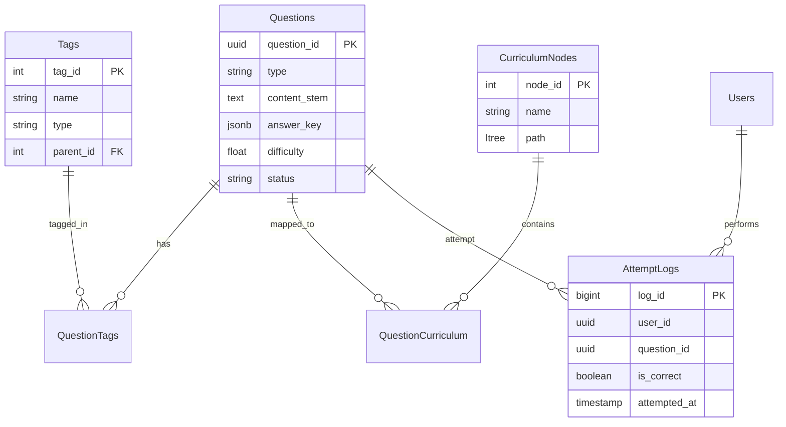

# Database Schema Design

## 개요
PostgreSQL의 강력한 기능인 `ltree`, `JSONB`, `Partitioning`을 적극 활용하여 계층형 커리큘럼과 대용량 로그 데이터를 효율적으로 관리합니다.

## ERD (Entity Relationship Diagram)

## 상세 테이블 명세

### 1. Questions (문제 테이블)
문제의 본문, 정답, 메타데이터를 저장합니다.

| Column | Type | Description |
|--------|------|-------------|
| `question_id` | UUID | PK, 자동 생성 |
| `question_type` | VARCHAR(50) | mcq, short_answer 등을 구분 |
| `content_stem` | TEXT | 문제 지문 (Markdown/LaTeX) |
| `answer_key` | JSONB | 정답 데이터 (구조화된 JSON) |
| `difficulty_index` | FLOAT | 0.0 ~ 1.0 (난이도) |
| `discrimination` | FLOAT | 변별도 (IRT 결과값) |
| `status` | VARCHAR(20) | draft, active, archived |
| `created_at` | TIMESTAMP | 생성일 |

### 2. CurriculumNodes (교육과정 - Ltree)
계층 구조를 가지는 교육과정을 `ltree`로 평탄화하여 관리합니다.

| Column | Type | Description |
|--------|------|-------------|
| `node_id` | SERIAL | PK |
| `name` | VARCHAR | 단원명 |
| `path` | LTREE | 계층 경로 (예: `Math.Algebra.Factorization`) |
| `description` | TEXT | 설명 |

**Index Strategy**:
- GIST Index on `path`: 하위 트리 검색 속도 최적화 (`WHERE path <@ 'Math.Algebra'`)

### 3. Tags (태그)
개념, 스킬, 출처 등 다차원 분류를 위한 태그입니다.

| Column | Type | Description |
|--------|------|-------------|
| `tag_id` | SERIAL | PK |
| `name` | VARCHAR | 태그명 |
| `tag_type` | VARCHAR | concept, skill, cognitive_level |
| `parent_tag_id` | INT | 계층형 태그를 위한 참조 |

### 4. AttemptLogs (학습 로그 - Partitioned)
학생들의 문제 풀이 이력을 저장하며, 시계열 특성을 고려하여 파티셔닝합니다.

| Column | Type | Description |
|--------|------|-------------|
| `log_id` | BIGSERIAL | PK (part of composite PK) |
| `user_id` | UUID | 사용자 ID |
| `question_id` | UUID | 문제 ID |
| `response_data` | JSONB | 학생이 제출한 답안 상세 |
| `is_correct` | BOOLEAN | 정답 여부 |
| `time_taken_ms` | INT | 소요 시간 (ms) |
| `attempted_at` | TIMESTAMP | 풀이 시각 (Partition key) |

**Partitioning Strategy**:
- 월별 파티셔닝 (`attempt_logs_yyyy_mm`) 적용하여 조회 및 관리 효율성 증대.

## 데이터 무결성 전략
- **Audit Trail**: 모든 변경 사항(문제 수정 등)은 별도의 History 테이블에 기록하지 않고 `version` 컬럼과 Trigger를 통해 관리하거나, 변경 이력 테이블을 별도로 둡니다. 본 설계에서는 Questions 테이블 내 `version` 업 방식 사용.
- **Constraints**: 
  - `difficulty_index` CHECK (0 <= val <= 1)
  - `status` ENUM check
